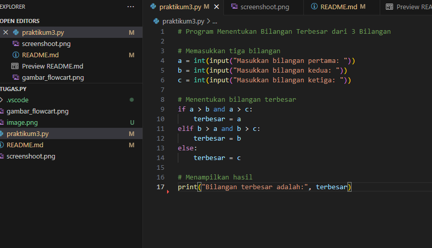
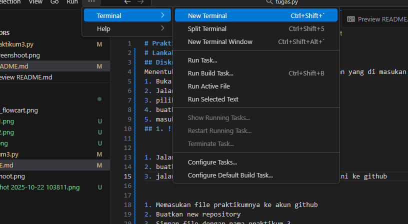
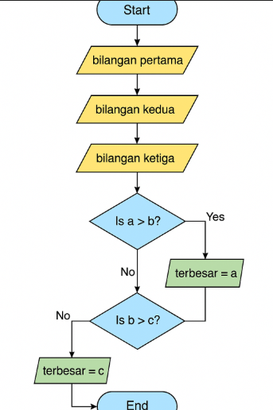

# Praktikum 3 - Menentukan Bilangan Terbesar
# Lankah lankah menjalankan proyek
## Diskripsi
Menentukan bilangan terbesar dari tiga buah bilangan yang di masukan denan menggunakan bahasa python
1. Buka folder di visual studio code (VS Code)
2. Jalankan visual studio code
3. pilih menu file baru 
4. buatkan file dengan nama praktikum3.py
5. masukan nilai input terbesar
## 1. 

1. Jalankan mengunakan termeninal
2. buatkan terminal baru (new terminal)
3. jalankan lankah-lankahnya untuk simpan project ini ke github
## 2. 

1. Memasukan file praktikumnya ke akun github
2. Buatkan new repository 
3. Simpan file dengan nama praktikum 3
## 2. 

## Flowchart
## 3. 
A = [MULAI] 
B = [INPUT]
C = [BILANGAN A,B,C]
D = [APAKAH A > B?] |YA| 
E = [TAMPILKAN A SEBAGAI BILANGAN TERBESAR]
F = [APAKAH B > C? ] |TIDAK|
G = [TAMPILKAN C SEBAGAI BILANGAN TERBESAR]
H = [TEBESAR C]
I = [SELESAI]

## Kode Progrogram
 menerima tiga input bilangan, kemudian menggunakan struktur percabangan `if-elif-else` untuk menentukan bilangan mana yang paling besar.
